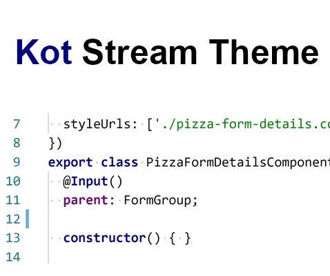
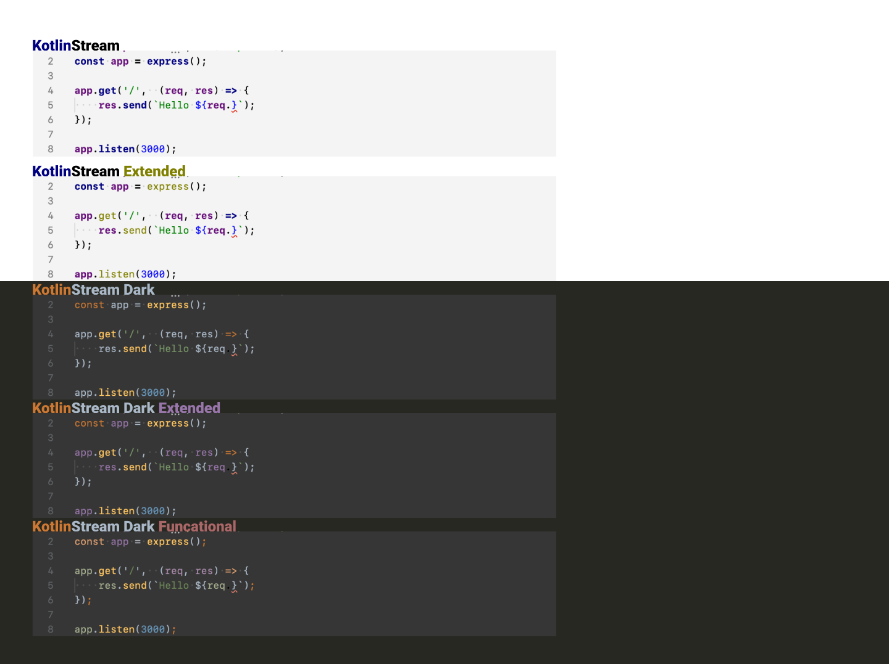

# KotlinStream Theme






## Description
This lightweight theme based on default JetBrains color scheme and extends 
[KotStream Theme Lite](https://github.com/owlruslan/kot-stream-theme-lite-vscode).

## Info
This theme has been optimized for JavaScript, TypeScript, PHP, CSS, SASS(SCSS), HTML, YAML and Shell. Other languages are not tested and may differ from the github code styles. Please file an issue or submit a PR in this case.

To get the full theme experience set the following settings in VSCode:     
```
"editor.fontFamily": "'Consolas','Liberation Mono','Menlo','Courier','monospace'",
"editor.fontSize": 13
```

### JavaScript


### PHP


### TypeScript


### HTML


### SCSS


### YAML


## For dimming
```
    "workbench.colorCustomizations": {
        "[KotStream Theme]": {
            "editor.background": "#F7F9FA"
        }
    }
```
## See also
A lightweight theme based on default JetBrains color scheme [KotStream Theme Lite on Github](https://github.com/owlruslan/kot-stream-theme-lite-vscode) and [KotStream Theme Lite on Market](https://marketplace.visualstudio.com/items?itemName=RuslanUsmanov.kot-stream-theme-lite).

## License
[MIT](LICENSE) © [Ruslan Usmanov](https://github.com/owlruslan)
